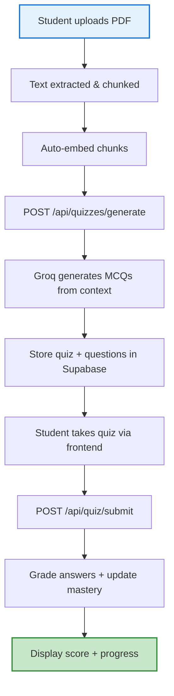
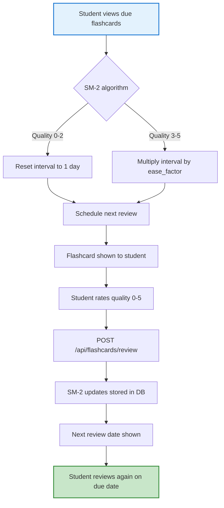
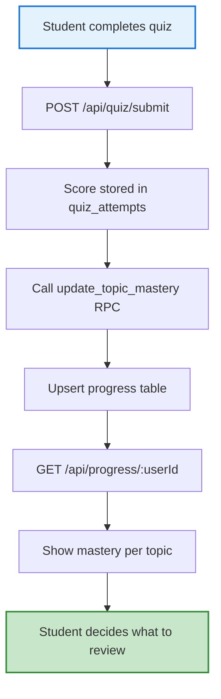

# VidyaAI

An AI-powered Computer Science study teacher: upload your course notes/PDFs and get RAG-grounded answers, auto-generated quizzes, and tracked mastery.

> **Hackathon MVP.** Three-person build split across Frontend (Person 1), Backend — Data & Ingestion (Person 2), and Backend — AI & Orchestration (Person 3).

---

## 📖 Table of Contents

1. [Quick Start](#quick-start)
2. [Prerequisites](#prerequisites)
3. [Installation](#installation)
4. [Environment Configuration](#environment-configuration)
5. [Running the Server](#running-the-server)
6. [Real-Life Usage Scenarios](#real-life-usage-scenarios) with flowcharts
7. [API Endpoints (Detailed)](#api-endpoints-detailed)
8. [Project Structure](#project-structure)
9. [Demo Data Seeding](#demo-data-seeding)
10. [Troubleshooting](#troubleshooting)
11. [Development Guidelines](#development-guidelines)

---

## Quick Start

If you already have all prerequisites met, run:

```bash
# 1. Install dependencies (both backend and frontend)
npm install

# 2. Copy and configure environment
cp .env.example .env
# Edit .env with your Supabase and API keys

# 3. Set up the database (run schema.sql against your Supabase project)
# See "Environment Configuration" section below

# 4. Start the backend server
npm run start   # or: node server.js
# Backend runs on http://localhost:5000

# 5. Start the frontend (Figma Make app)
cd frontend
npm run dev
# Frontend runs on http://localhost:8443
#   - Auto-proxies /api requests to http://localhost:5000

```

**Alternatively**, from the root directory with concurrently:
```bash
npm install
# then
npx concurrently "node server.js" "cd frontend && npm run dev"
# Backend: http://localhost:5000, Frontend: http://localhost:8443
```

---

## Prerequisites

| Requirement | Version/Notes |
|---|---|
| **Node.js** | >= 18.x (commended: 20 LTS) |
| **npm** | >= 9.x (or yarn/pnpm) |
| **Supabase Project** | Free tier sufficient |
| **Google API Key** | For embeddings (optional — placeholder fallback works) |
| **Groq API Key** | For AI chat/quiz/flashcard generation (optional but recommended) |

---

## Installation

```bash
# Clone the repository
git clone https://github.com/NexiSynapse/VidyaAI.git
cd VidyaAI

# Install npm dependencies
npm install
```

The project uses these key dependencies (from `package.json`):

- `express` — Web server framework
- `@supabase/supabase-js` — Supabase client
- `pdf-parse` — PDF text extraction
- `pdfkit` — PDF generation (demo seeding)
- `google-tts-api` — Text-to-speech
- `multer` — File upload handling
- `openai` — Groq API wrapper
- `cors`, `dotenv` — Middleware

---

## Environment Configuration

### 1. Copy the template

```bash
cp .env.example .env
```

### 2. Edit `.env` with your keys

| Variable | Required? | Where to get it | Description |
|---|---|---|---|
| `SUPABASE_URL` | **Yes** | Supabase Dashboard → Project Settings → API → Project URL | Your Supabase project URL (e.g., `https://xyz.supabase.co`) |
| `SUPABASE_KEY` | **Yes** | Supabase Dashboard → Project Settings → API → anon public key | Your Supabase anon/public key |
| `OPENAI_API_KEY` | No | https://platform.openai.com/api-keys | **Optional.** If blank, placeholder embeddings are used. Real OpenAI gives meaningful semantic search. |
| `PORT` | No | – | Port for server (defaults to `5000`) |
| `GROQ_API_KEY` | Recommended | https://groq.com/console | For AI chat, quiz generation, and flashcard generation |
| `GOOGLE_API_KEY` | Recommended | Google AI Studio | For Google embeddings (semantic search). Without this, placeholder embeddings work for local dev/demo. |

### 3. (Optional) Create a `settings.json` file

The server also reads from `settings.json` in the project root for runtime configuration changes without restarting. Example:

```json
{
  "groqApiKey": "your-groq-key",
  "googleApiKey": "your-google-key",
  "groqModel": "mixtral-8x7b-32768",
  "chunkSize": 700,
  "chunkOverlap": 15
}
```

This file is read on startup and can be updated via `POST /api/settings`.

---

## Running the Server

```bash
# Development mode
npm start

# Or explicitly
node server.js

# Output
 VidyaAI server running on http://localhost:5000
 Groq: configured / not configured
 Google Embeddings: configured / not configured
```

The server will start on `http://localhost:5000` (or the `PORT` you configured).

### Health Check

Visit `http://localhost:5000/api/settings` to verify your configuration is loaded correctly.

---

## Real-Life Usage Scenarios

### Scenario 1: Upload Course Notes and Ask Questions

```mermaid
flowchart TD
    A[Student logs into VidyaAI] --> B[Upload PDF of course notes]
    B --> C{Extract text & chunk}
    C --> D[Generate embeddings (Google or placeholder)]
    D --> E[Store in Supabase (documents + chunks)]
    E --> F[Search over chunks (RAG)]
    F --> G[Groq LLM answers question using context]
    G --> H[Display answer + citations]
    H --> I[User rates helpfulness (implicit)]

    style A fill:#e3f2fd,stroke:#1976d2,stroke-width:2px
    style H fill:#c8e6c9,stroke:#388e3c,stroke-width:2px
```

**Real-life example:**  
*Alice is taking a Data Structures course. She uploads her BST lecture PDF. Later, she asks "What is the time complexity of BST search?" VidyaAI retrieves the relevant chunk from her PDF, passes it to Groq, and returns: "Search: O(log n) average, O(n) worst case (degenerate tree)." with a citation to her source material.*

---

### Scenario 2: Generate a Quiz from Uploaded Material



**Real-life example:**  
*Bob uploads his "Algorithms" lecture notes. He runs "Generate 5-question quiz." VidyaAI uses Groq to create MCQs on sorting algorithms, binary search, and DP. Bob takes the quiz, gets an 80% score, and his topic mastery for "Algorithms" updates to 80%.*

---

### Scenario 3: Flashcard Review with SM-2 Spaced Repetition



**Real-life example:**  
*Carol has flashcards for "TCP Three-Way Handshake." After reviewing with quality 5, the interval grows from 1 day → 6 days → 18 days (with ease_factor 2.5). She only sees those flashcards again when they're due, optimizing her study time.*

---

### Scenario 4: Progress & Mastery Tracking



**Real-life example:**  
*Dave takes 3 quizzes: 70% on OS, 90% on Networks, 60% on DBs. His progress shows: OS mastery 70%, Networks 90%, DBs 60%. He decides to review DB materials more before retaking the quiz.*

---

## Project Structure (Backend/Data - Person 2)

- [`server.js`](./server.js) — Express API server (ingestion, retrieval, quizzes, progress)
- [`schema.sql`](./schema.sql) — Postgres + pgvector schema & stored functions
- `.env` *(local only, gitignored)* — secrets
- `.env.example` — template for new contributors

---

## Frontend (Figma Make App - Person 1)

The project includes a Figma-based frontend that runs on **port 8443** and proxies API calls to the backend.

### How to run

```bash
cd frontend
npm run dev
# Frontend: http://localhost:8443
```

### Key details

- **Framework**: React 19 + Tailwind CSS + d3.js
- **Vite config** (`frontend/vite.config.ts`): 
  - Port: `8443` (configurable via `PORT` env var)
  - Proxies `/api` requests to `http://localhost:5000` (the VidyaAI backend)
  - Host: `0.0.0.0` for development
- **Figma Make app**: This is a special Figma-hosted application (not a traditional web app). It's configured via `.figma/make/site.json` and uses Figma-specific plugins.
- **API proxy**: All `/api/*` requests from the frontend are automatically forwarded to the backend at `http://localhost:5000`, so you can make API calls from the frontend without dealing with CORS manually.
- **Static files**: The `frontend/public` directory and `index.html` serve as the HTML entry point.

### Development

- `npm run dev` — starts Vite dev server on port 8443
- `npm run build` — builds for production
- `npm run preview` — preview the production build
- The frontend makes API calls to `/api/...` endpoints (see the Backend API section above)

---

## API Endpoints (Detailed)

| Endpoint | Method | Auth | Purpose | Request Body | Response |
|---|---|---|---|---|---|
| `/api/auth/register` | POST | None (or Supabase) | Register a new user | `{ email, password, fullName? }` | `{ user, token }` |
| `/api/auth/login` | POST | None (or Supabase) | Log in | `{ email, password }` | `{ user, token }` |
| `/api/auth/me` | GET | Bearer token | Get current user profile | – | `{ user }` |
| `/api/auth/logout` | POST | Bearer token | Log out | – | `{ message }` |
| `/api/ingest` | POST | Bearer token | Upload PDF → extract → chunk → embed → store | `{ documentId?, topicId? }`, `file` (multipart) | `{ success, documentId, chunksCount }` |
| `/api/documents` | GET | Bearer token | List all documents | – | `[{ id, title, topic, chunk_count, ... }]` |
| `/api/documents/:id` | DELETE | Bearer token | Delete document + cascading deletions | – | `{ success }` |
| `/api/topics` | GET | Bearer token | List all topics | – | `[{ id, name, description }]` |
| `/api/topics` | POST | Bearer token | Create a topic | `{ name, description? }` | `{ id, name, description }` |
| `/api/search` | POST | Bearer token | Semantic vector search (RAG) | `{ query, documentId?, useAdvanced? }` | `{ chunks: [{ content, similarity, ... }] }` |
| `/api/chat` | POST | Bearer token | RAG chat with Groq (advanced pipeline) | `{ query, documentId?, useAdvanced? }` | `{ answer, citations: [ {snippet, similarity} ] }` |
| `/api/quizzes` | POST | Bearer token | Create a quiz manually | `{ documentId, topicId, title, questions }` | `{ id, title }` |
| `/api/quizzes/generate` | POST | Bearer token | Auto-generate quiz with Groq | `{ documentId, topicId?, title?, questionCount? }` | `{ id, title, questions }` |
| `/api/quizzes/:id` | GET | Bearer token | Fetch quiz + questions | – | `{ quiz, questions }` |
| `/api/quiz/submit` | POST | Bearer token | Submit answers → grade → update mastery | `{ quizId, userId, answers }` | `{ score, results }` |
| `/api/attempts/:userId` | GET | Bearer token | Fetch user's quiz attempt history | – | `[{ quiz, score, ... }]` |
| `/api/progress/:userId` | GET | Bearer token | Fetch mastery per topic | – | `[{ topic, mastery_score }]` |
| `/api/flashcards/due` | GET | Bearer token | Fetch due flashcards (SM-2) | `{ userId }` | `[{ id, question, answer, next_review, ... }]` |
| `/api/flashcards/review` | POST | Bearer token | Submit SM-2 quality rating | `{ cardId, userId, quality (0-5) }` | `{ nextReviewDate, card }` |
| `/api/flashcards/generate` | POST | Bearer token | Auto-generate flashcards from document | `{ documentId, topicId?, count? }` | `{ flashcards, count }` |
| `/api/settings` | GET | Bearer token | Get current settings | – | `{ apiKey, groqApiKey, ... }` |
| `/api/settings` | POST | Bearer token | Update settings | `{ groqApiKey?, googleApiKey?, chunkSize?, chunkOverlap?, groqModel? }` | `{ success }` |
| `/api/demo/seed` | POST | None | Populate demo data (topics, docs, quizzes, flashcards) | – | `{ success, stats }` |
| `/api/demo/clear` | POST | None | Clear all demo data | – | `{ success }` |

---

## Project Structure

```
VidyaAI/
├── server.js              # Express API server (all routes, ingestion, RAG, quizzes, mastery, flashcards)
├── schema.sql             # Postgres + pgvector schema + stored functions
├── package.json           # Dependencies and scripts
├── .env.example           # Environment variable template
├── .env                   # Local secrets (gitignored)
├── settings.json          # Runtime settings (optional)
├── uploads/               # Uploaded files directory
│   └── demo_pdfs/         # Demo PDF files (created on seed)
├── check_doc.js           # Document validation tool
├── check_supabase.js      # Supabase connection check
└── README.md              # This file
```

### Key Files Explained

- **`server.js`** (2089 lines): The heart of the application. Contains:
  - Express routes for auth, ingestion, search, chat, quizzes, flashcards, progress
  - PDF text extraction (`extractText`)
  - Hybrid chunking logic (`chunkText`)
  - Google embedding generation with placeholder fallback (`googleEmbed`, `placeholderEmbedding`)
  - Query rewriting via Groq (`rewriteQuery`)
  - Chunk reranking via Groq (`rerankChunks`)
  - Auto-quiz and auto-flashcard generation using Groq
  - SM-2 flashcard review logic
  - Topic mastery tracking via Supabase RPC

- **`schema.sql`** (308 lines): Postgres schema + pgvector extensions. Includes:
  - `topics`, `documents`, `chunks`, `quizzes`, `quiz_questions`, `quiz_attempts`, `progress` tables
  - `match_chunks` — vector cosine similarity search function
  - `update_topic_mastery` — calculates average quiz score per topic
  - `sm2_update_flashcard` — SM-2 spaced repetition algorithm
  - `get_due_flashcards` — fetches flashcards due for review
  - `generate_flashcards_from_chunks` — deterministic fallback for flashcard creation

- **`uploads/`**: Directory where uploaded PDFs are temporarily stored (multer `dest: 'uploads/'`). Cleared after ingestion.

---

## Demo Data Seeding

The project includes a demo seeding endpoint that populates the database with CS topics, PDFs, quizzes, and flashcards without requiring manual setup.

### How to seed demo data

```bash
# 1. Make sure .env has your Supabase keys
# 2. Start the server: npm start
# 3. POST http://localhost:5000/api/demo/seed
```

**What gets created:**

| Category | Count (approx) |
|---|---|
| Topics | 7 (Data Structures, Algorithms, Operating Systems, Computer Networks, Databases, plus 2 more) |
| Documents | 14 (2 per topic) |
| Chunks | ~200 (based on text length + chunking) |
| Quizzes | 15+ (one per document, with questions) |
| Flashcards | 28+ (2 per document) |

### Demo topics include

- **Data Structures**: Binary Search Trees & AVL Trees, Heaps & Priority Queues
- **Algorithms**: Dynamic Programming & Memoization, Graph Traversals & Shortest Paths
- **Operating Systems**: Virtual Memory & Page Replacement
- **Computer Networks**: TCP/IP & Three-Way Handshake, DNS Resolution & HTTP/HTTPS
- **Databases**: Relational Normalization & B-Tree Indexing

Each document comes with:
- A generated PDF in `uploads/demo_pdfs/`
- Auto-embedded chunks
- An AI-generated quiz (5 MCQs with explanations)
- 2 auto-generated flashcards

### To clear demo data

```bash
POST http://localhost:5000/api/demo/clear
```

This removes all demo users, documents, chunks, quizzes, questions, flashcards, and review history.

---

## Troubleshooting

| Issue | Likely Cause | Fix |
|---|---|---|
| `EPERM: operation not supported, scandir 'uploads'` | Uploads directory permissions | Run `chmod 755 uploads` or ensure the process has write access |
| `Google embedding failed (403)` | Invalid `GOOGLE_API_KEY` | Check your key at Google AI Studio; ensure it has embedding API access |
| `Groq API error: 401 Unauthorized` | Invalid `GROQ_API_KEY` | Verify your key at groq.com-console |
| `match_chunks returns no results` | `SUPABASE_URL`/`SUPABASE_KEY` mismatch, or `pgvector` extension not enabled | Verify Supabase project URL/keys, run `schema.sql` to enable `vector` extension |
| `PDF text extraction fails` | Corrupted or password-protected PDF | Ensure PDFs are text-extractable; the server falls back to raw binary if pdf-parse fails |
| `OPENAI_API_KEY not working` | OpenAI key is optional; placeholder embeddings will be used instead | Leave `OPENAI_API_KEY` blank if you want to use Google embeddings or placeholder mode |
| `CORS error on frontend` | Frontend calling different port | Ensure frontend base URL matches or CORS is configured in `server.js` |
| `Demo seed fails on duplicate key` | Running seed twice without clearing | Run `/api/demo/clear` first, or use a fresh Supabase project |

### No API keys? (Local development mode)

If you **don't** set `GOOGLE_API_KEY` or `GROQ_API_KEY`:

- **Placeholder embeddings** will be used for semantic search. The vectors are deterministic hashes based on chunk content, so search still works but is less accurate (similar topics may not retrieve).
- **Quiz/flashcard generation** will fail because Groq is required for AI generation. You'll need to add a Groq key or manually create quizzes/flashcards.
- **TTS (text-to-speech)** will fail because Google TTS requires an API key (but the code has fallback handling).

---

## Development Guidelines

### Adding a New Route

1. Open `server.js`
2. Add your route following the existing pattern (see `/api/ingest`, `/api/search`, etc.)
3. Use `supabase.from('table').select()` for database queries
4. Return JSON responses with appropriate status codes
5. Wrap async functions in `try/catch` and log errors

### Adding a New Stored Function to `schema.sql`

1. Add the SQL function definition at the bottom of `schema.sql`
2. Reload your SQL editor and run the migration
3. The Supabase client will automatically expose the function as an RPC call

### Code Style

- Use `dotenv` for environment variables — never hardcode keys
- Follow the existing `try/catch` + `console.error` pattern
- Keep chunk sizes and overlap percentages configurable via `settings.json` or `.env`
- All user-facing error messages should be descriptive but not expose internal details
- Use the `sanitizeForPostgres` helper whenever inserting text into PostgreSQL to prevent null-byte crashes

### Testing Locally

```bash
# Start server
npm start

# Test endpoints with curl or Postman
curl -X POST http://localhost:5000/api/settings \
  -H "Content-Type: application/json" \
  -d '{"groqApiKey":"your-key"}`

# Or use the browser to visit http://localhost:5000/api/settings
```

---

## 🎓 Learning Path: How VidyaAI Works End-to-End

1. **Upload** → PDF is received by `/api/ingest` → text extracted (`pdf-parse`) → hybrid chunked (`chunkText`) → embedded via Google (`googleEmbed`) or placeholder → stored in Supabase `chunks` table with vector embeddings.

2. **Search** → User types a query → query is rewritten via Groq (`rewriteQuery`) → embedded (`embedQuery`) → vector search via Supabase RPC `match_chunks` (cosine similarity) → optional reranking via Groq (`rerankChunks`) → top-k chunks returned.

3. **Chat** → Selected chunks are formatted as context → system prompt instructs Groq to answer using **only** the course material → answer + 3 citations returned to user.

4. **Quiz** → `/api/quizzes/generate` → context (top chunks) sent to Groq → AI returns MCQs → stored in `quizzes` + `quiz_questions` tables.

5. **Mastery** → After quiz submission (`/api/quiz/submit`) → `update_topic_mastery` RPC calculates average score → upserts `progress` table → `GET /api/progress/:userId` shows mastery per topic.

6. **Flashcards** → `/api/flashcards/generate` → context sent to Groq → AI returns Q&A pairs → stored in `flashcards` with SM-2 fields (`ease_factor`, `interval_days`, `repetitions`, `next_review`).

7. **Review** → `GET /api/flashcards/due` → returns flashcards where `next_review <= NOW()` → student reviews → `POST /api/flashcards/review` → SM-2 algorithm updates `interval_days`, `repetitions`, `ease_factor`, `next_review`.

---

*Built with ❤️ for the CS education hackathon. Questions? Open an issue on the [GitHub repository](https://github.com/NexiSynapse/VidyaAI).*